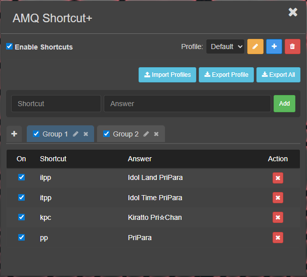
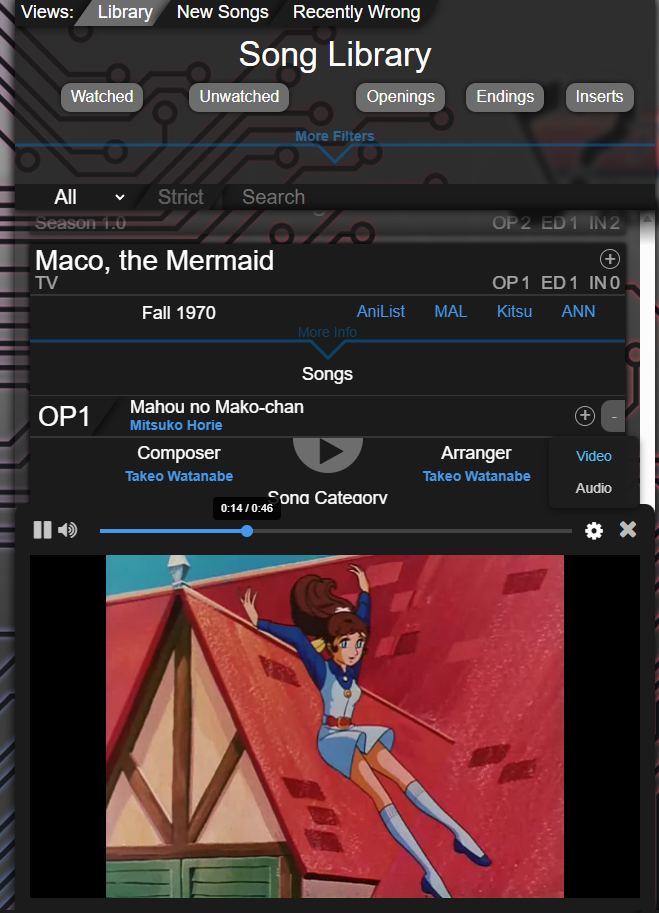

<h1 align="center">AMQ Scripts</h1>
These are scripts for Anime Music Quiz game.

## [AMQ Shortcut+](https://github.com/easterechidna/amq-scripts/raw/main/amqShortcutPlus.user.js)

  
   

Allows you to type shortcuts for anime titles in the answer box. 
Supports multiple profiles, groups, and import/export. 
Autocomplete in the adding shortcut box will be available after entering the game.  
To access the settings, hover your mouse over the gear icon at the bottom right of the screen and click on “Shortcut+”.

## [AMQ Return Library Video](https://github.com/easterechidna/amq-scripts/raw/main/amqReturnLibraryVideo.user.js)

  
   

Removed sample limits and brought back video to the Song Library. Two modes: Audio and Video. Worked in both Quiz Builder and Song Library.